[TOC]
# 要点
- 环境概论
- 生态学基础
- **城市环境生态学基本原理**
- **城市生态系统的平衡与调控**
- 城市人口
- 城市环境概要
- **城市大气污染与控制**
- **城市水资源及水污染控制**
- **城市固体废物污染及控制**
- **城市噪声及其他物理污染与控制**
- 城市气候
- **城市灾害及预防**
- 城市植被与景观
- 城市环境质量评价
# 老师发话
1. 你们总结的还行，个别有出入；
2. 生态系统相关内容，漏掉了几种物质循环，上课强调过。
3. 后面大气、水、噪声，除了你们总结的，还需要系统掌握相关概念及评价相关因子、影响要素、评价方法、预测的内容及计算方法、污染防治措施。  
其中，计算相关：大气的环境空气质量指数的计算（公式要不要背看你们自己，插值而已），大气预测公式不需要记。水环境：掌握河流零维和一维计算，包括公式。噪声：加减法及随距离衰减的计算，需自己记住公式。
4. 固体废弃物：相关概念和管理措施

# 第一章 环境概论
## 第一节  环境及其结构/构成
- 环境的概念：作用于人的一切外界事物和力量的总和
- 环境构成：
   - 自然环境
      - 物质（大气、水、岩石、土壤、动植物、微生物）
      - 能量（内能如地震、火山；外能如太阳能、潮汐力）
   > 人类目前赖以生存的自然条件和自然资源的总称，是直接或间接影响到人类的一切自然形成的物质、能量和自然现象的总体，对人类的影响是根本的
   - 社会环境（人工环境）
      - （人工建筑、政治、经济文化、教育、科技、宗教信仰等 ）
    > 狭义：人类根据生产、生活、科研、文化、医疗等需要而创造的环境空间，如温室、无尘车间、人工气候室、人工园林等。  
    广义：由于人类活动而形成的环境要素，包括由人工形成的物质、能量、和精神产品以及人类活动过程中所形成的人与人之间的环境

## 第二节  环境要素及属性
- 环境要素(环境基质)：是构成人类生存环境整体和各个独立的、性质不同而又服从整体演化规律的基本物质组分
   - 自然、人工环境要素
- 环境要素的基本属性：
   - 最差（小）因子限制定律
   - 等值性
   - 整体性大于各个体之和
   - 互相联系及相互依存

## 第三节  环境的功能与特性
- 环境的功能
   - 空间功能：提供人类和其他生物栖息、生长、繁衍的场所
   - 营养功能：提供生物生长、繁衍所必需的各类营养物质及各类资源、能源。
   - 调节功能：调节、净化
      - 水体、森林：调节气候、吸收净化污染物    
- 环境的特性
   - 自身：动态、开放的系统
   - 对于干扰
      - 整体性，无地区和国界
      - 有限性，地球空间、资源有限、稳定性有限、自己能力有限……
      - 不可逆，物质循环和能量流动，部分环境破坏后，无法恢复- 最初状态
      - 隐显性，水俣病（日本汞污染）20年才显现
      - 持续性，DDT
      - 灾害放大性，上游林地破坏，可能导致下游洪涝灾害
## 第四节  环境问题
- 概念
> 狭义指由于人类的生产、生活活动导致生态系统失去平衡、反过来影响人类生存和发展的一切问题；  
广义指自然力和人力引起生态平衡破坏，最后直接或间接影响人类生存和发展的一切问题。
- 分类（按根源分）
   - 第一环境问题（原生、自然灾害）
   - 第二环境问题（次生、人类活动引起）
   > 6月5日被确定为世界环境日
  
# 生态学基础
## 第一节 概述
> 生态学是研究有机体、物理环境与人类社会的科学
## 第二节 生物生存环境——生物圈
- 概念
> 地球上所有生物及其生活环境的总称。由生物与非生物的物理化学环境组成的高度复杂的生态系统。

## 第三节 生态因子及其作用
- 概念
   > 生态因子(ecological factors)是指环境中对生物的生长、发育、生殖、行为和分布有着直接或间接影响的环境要素。如：温度、湿度、土壤、食物、氧气等。
   - 生态环境(Eco- environment)：生态因子的总和。
   - 生境(Habitat)：特定生物群落地段上的生态因子的总和。
- 分类
   - 按性质
      - 生物因子（biotic factors）
         - 有机体（同种和异种）
      - 非生物因子（abiotic factors）
         - 温度、光、湿度、pH、氧气等
   > 气候、土壤、地形、生物、人为因子
   - 按影响方式
      - 密度制约因子(density independent factors)
         - 食物、天敌等生物因子
         > 其作用强度随种群密度的变化而变化, 因此有调节种群数量, 维持种群平衡的作用（竞争、捕食）
      - 非密度制约因子(density dependent factors)
         - 温度、降水、气候等非生物因子
- 非生物生态因子与生物的关系
   - 非生物生态因子对生物的影响，又称环境对生物的作用
   - 生物对环境的影响，又称生态效应
- 生物与生物的关系
   - 相互作用
- 生态因子对生物作用的特点
   - 综合性
   - 非等价性（主导性）：主导作用
   - 不可替代性和互补性
   - 限定性
- 生物与环境关系的基本原理
   - 最小因子定律
   - 耐受定律
      - 生态幅
   - 限制因子原理
   
## 第四节 生态系统的基本概念及类型
- 生态系统概念
   > 指在一定的空间内生物的成分和非生物的成分通过物质的循环和能量的流动互相作用、互相依存而构成的一个生态学功能单位。
- 生态系统的类型
   - 按人类对生态系统的干预程度划分
      - 自然生态系统
      - 半自然生态系统
      - 人工生态系统
   - 按生态系统空间环境性质划分
      - 陆地生态系统
      - 淡水生态系统
      - 海洋生态系统

## 第五节 生态系统的基本功能
- 生物生产
- 能量流动
   - 能量单向流动，逐级减少
   - 系统外的能量补充
- 物质循环
   - 相关概念
      - 库（分室）
      - 流通率
      - 周转率
      - 周转时间
   - 水循环
      - 生物发挥了巨大的作用
      - 水时空分布是不均衡的
      - 地球上各种水体的周转期不同
   - 气体型循环
   - 沉积型循环
   > 气体型循环和沉积型循环虽然各有特点，但都受能流的驱动，并都依赖于水循环。
   - 具体循环：
      - 水循环
      - 碳循环
      - 氮循环
      - 磷循环
      - 硫循环
      - 有毒物质循环
         - 汞循环

## 第六节 生态系统的反馈调节与生态平衡
- 反馈
   - 概念
   > 当生态系统中某一成分发生变化的时候，它必然会引起其他成分出现一系列的相应变化，这些变化最终又反过来影响最初发生变化的那种成分，这个过程就叫反馈
   - 负反馈
   - 正反馈
   > 自然界生态系统常常趋向于达到一种稳态或平衡状态，这种平衡状态是靠具有负反馈的自我调节过程来实现的
- 生态平衡
> 在通常情况下，生态系统会保持自身的生态平衡。生态平衡是指生态系统通过发育和调节所达到的一种稳定状况，它包括结构上的稳定、功能上的稳定和能量输入输出上的稳定。

# 第三章 城市环境生态学
## 第一节  城市环境生态学及其基本原理
- 概念
   - 城市：以人类占优势的新型生态系统
   - 城市环境生态学
   > 以生态学的理论和方法研究城市人类活动与周围环境之间的关系的科学，以整体的观点，把城市视作一个以人为中心的生态系统  
   理论上，研究其发生和发展的原因；组合和分布的规律；结构和功能的关系；调节和控制的机理；  
   应用上：运用生态学原理来规划、建设和管理城市，提高资源利用效率，改善系统关系，使该生态系统沿着有利于人类利益和可持续的方向发展。
- 基本原理
   - 城市生态位
   > 城市生态位是一个城市给人们生存和活动所提供的生态位，即城市中的生态因子和生产关系的集合  
   - 生态因子： 水、食物、气候、土地、能源、交通、建筑等
   - 生产关系：生产力、生活质量、环境质量、与外系统的关系等
   - 分类
      - 生产生态位
      - 生活生态位
   > 城市生态位是城市满足人类生存发展所提供的各种条件的完备程度。
   - 多样性导致稳定性
   - 食物链原理
   - 最小因子原理
   - 系统整体功能最优化原理
   - 环境承载力原理
## 第二节  城市生态系统的组成与结构
- 概念：城市生态系统
> 以人为核心的系统，不仅包含自然生态系统的组成要素，也包括人类及其社会经济等要素，是一个**自然**、**经济**与**社会**复合的人工生态系统
- 组成
   - 城市居民
   - 自然环境
   - 经济系统
   - 社会系统
- 结构形式
   - 链结构
      - 食物链结构（营养结构）
         - 自然食物链
         - 完全人工食物链
      - 资源链结构
   - 生命与环境相互作用结构
   - 空间组合结构
      - 圈层式
      - 镶嵌式

## 第三节  城市生态系统的特征
- 人是主体
   - 生物量方面：人口发展限制了其它生物的发展
   - 人的作用：城市居民既是消费者，又是经济生态系统中的生产者
- 高度人工化
   - 人工化的环境
   - 人工化的营养结构
   - 人工化生态系统对人类的反作用
- 不完整性
   - 缺乏“生产者”（绿色植物）
   -  缺乏分解者  
   > 城市生态系统是一个不完全、不独立的生态系统
- 高度开放性
   - 所需能量和物质由系统外输入
- 脆弱性
   - 不是自律系统
   > 存在大量的输入和输出，不能独立存在，必须依赖其它生态系统才能存在和发展
   - 自我调节机能脆弱
   - 营养关系倒置
- 多层次的复杂系统
   - 生物（人）-自然环境系统
   - 人-经济系统
   - 人-社会文化系统
   > 各层次的子系统内部，都有自己的能量流、物质流和信息流。各层次之间又相互联系，构成不可分割的整体
## 第四节  城市生态系统基本功能
- 生产功能
   - 生物生产
      - 生物初级生产
      > 绿色植被的生产，其不占主导地位，甚至微不足道。但植被景观功能和环境保护功能十分重要。初级生产功能发生了转变
      - 生物次级生产
   - 非生物生产
      - 物质生产
      - 非物质生产
- 能量流动功能（能量在系统内外的传递、流通和耗散）
   - 能源分类
      - 按来源：太阳能；地热能；原子核能；潮汐能
   - 能源结构
   > 能源总生产量和总消费量的构成及比例关系能够反映一个国家的生产技术和经济发展水平  
   发达国家能源消费以热值高、污染少的能源为主
- 物质循环功能
   - 城市生态系统物质流类型
      - 自然力推动的物质流
      - 人工推动的物质流
      - 人口流
         - 常住人口流
         - 流动人口流
      - 其它物质流
         - 价值流
         - 资金流
   - 城市生态系统物质循环的特点
      - 系统内外物流量大
      - 缺乏生态循环
      - 受到人为因素的强烈影响
      - 物质循环过程中产生大量废物
- 信息传递功能
   - 信息的概念
   - 信息的作用
   - 城市的信息传递 

## 第五节  城市生态系统评价
- 评价内容
   - 城市生态环境现状评价
   - 城市发展对生态环境的综合影响评价
- 评价指标确定原则
   - 具备可查性、可比性、定量性
- 评价方法
   - 选择指标；划分若干层次与若干小系统；综合研究，选择评价指标；综合指标
- 评价指标体系
   - “经济-社会-生态”指标体系
      - 经济发展水平指标
      - 社会生活水平指标
      - 生态环境质量指标
   - “人口-能源、交通-自然环境-社会”指标体系
      - 人口
      - 能源、交通
      - 自然环境
      - 社会福利
      - 国民经济

## 第六节  城市生态规划
> 根据生态学和城市规划原理，对城市各项开发与建设项目作出科学合理的决策，从而调控城市居民和环境的关系
- 规划目标
   - 城市人类与环境的协调
   - 城市区域发展的协调
   - 城市经济、社会与生态的可持续发展
- 规划内容
   - 经济、人口、资源、环境的协调发展
   - 人口、土地、污染、生物绿化、资源
- 规划原则
   - 自然、经济、社会生态原则
- 规划的方法和步骤
   - ...

## 第七节  城市生态建设     
> 根据生态学原理，协调人与环境、城市内部结构与外部环境的关系，其基本点是合理利用环境容量（环境承载力）
- 城市生态建设的内容
   - 适宜的人口容量（与物质生产和自然资源相适应）
   - 适宜的土地利用（最大限度地发挥土地潜力）
   - 优化产业结构（综合利用资源、互相利用产品和废弃物）
   - 建立市区和郊区复合生态系统
   - 防治城市环境污染
   - 城市生物保护
   - 提高资源利用效率
- 生态城市
   - 生态城市衡量标志
      - 高效率的物质转换系统、高效率的流通系统
      - 高质量的环境状况、完善的城市绿化系统
      - 良好的人文环境、高效率的管理体系

# 第四章 城市环境概要
## 第一节  城市生态环境组成与特点
- 环境的组成
   - 物理环境
      - 自然环境
      - 人工环境
   - 社会环境
   - 经济环境
   - 美学环境（景观环境）
- 城市环境的特点
   - 有相对明确的界限
   - 高度人工化
   - 结构复杂、功能多样
   - 受多种因素制约
   - 系统脆弱
      - 对外部系统高度依赖

## 第二节  城市环境容量
- 环境容量
   - 概念
   > 在自然生态结构和正常功能不受损害、人类生存环境质量不下降的前提下，能容纳的污染物的最大负荷量
   - 影响因素
      - 环境空间大小、各环境要素的特性和净化能力、污染物的理化性质等
- 城市环境容量
   - 概念
   > 具体指在城市特定区域内，环境所能容纳污染物的最大负荷，即城市对污染物的净化能力，或为保持某种生态环境标准所允许的污染物排放总量  
   是环境对于城市规模及人的活动提出的限度。
   - 影响因素
      - 自然环境条件、物质因素、经济技术因素
- 城市环境容量的内容
   > 包括人口、自然环境、用地、工业、交通、建筑容量等
   - 城市人口容量
   - 城市大气环境容量
   - 城市水环境容量
   - 土壤环境容量
   - 城市工业容量
   - 城市交通容量

## 第三节  城市生态环境的问题   
> 城市生态环境问题的实质是：城市人类生存环境质量下降以及由此引起的城市人类生存危机
- 自然生态系统遭到破坏
- 土地的变化
   - 城市占用土地扩大
   - 地下水位下降、地面沉降
   - 土壤污染
- 气候和大气的变化
   - 气候变化
   - 大气污染
- 淡水短缺和水污染
   - 淡水短缺
   - 城市水污染
- 噪声污染
- 电磁波污染

# 第五章  城市大气污染与控制
## 第一节  大气污染及危害
- 大气环境
   > 大气是指包围在地球外部的空气层。由大气所形成的围绕地球周围的混合气体成为大气圈，又称为大气环境  
厚度：2000-3000km  
由于大气的成分和物理性质在垂直方向上有显著地差异，因此可按大气在各个高度的特征分成若干层次。
   - 对流层
   > 通常发生的大气污染现象就发生在这一层，特别是靠近地面1-2km
   - 平流层
   - 中间层
   - 热成层
   - 逸散层
- 干洁空气
> 干洁空气是指在自然状态下的大气，除液体、水汽和杂质外的整个混合气体。
- 大气污染的定义
   > 由于人类活动和自然过程引起的某种物质进入到大气中，呈现出足够的浓度、达到足够的时间，因此危害了人体的舒适、健康、福利或危害了环境的现象
   - 大气污染分类：按污染范围分为
      - 局部大气污染，如某个烟囱造成的污染
      - 地区性大气污染，工矿区或附近地区的污染
      - 广域性大气污染，大城市或大工业带出现的大气污染
      - 全球性大气污染，如酸雨、臭氧层破坏、温室效应等
- 中国城市污染概况
   - 燃煤大气污染
   - 工业大气污染
   - 机动车船大气污染
   - 扬尘污染
   - 其他大气污染。包括燃放烟花爆竹、餐饮服务业油烟放、秸秆焚烧等。

- 城市大气环境中的主要污染物
   - 按形态分为：
      - 颗粒态污染物
      - 气态污染物
   - 按与污染源的关系分为：
      - 一次污染
      - 二次污染
   - 颗粒污染物（包括固体和液体粒子）
      - 尘粒
      - 粉尘
      - 烟尘
      - 雾尘
   - 几个重要的指标
      - 总悬浮颗粒物（TSP，Total Suspended Particulate ）
         - 悬浮于空中，空气动力学当量粒径小于等于100**微米**的颗粒物；
      - 可吸入颗粒物（PM10）
      - PM2.5
   - 气态污染物
      - 碳氧化合物
      - 含硫化合物
      - 含氮化合物
      - 碳氢化合物
      - 卤素化合物
   - 二次污染物
      - 原发性污染物(一次):直接排放的原始污染物
      - 继发性污染物（二次）：一次污染物与大气中原有成份间，经化学或光化学反应而生成的新污染物质。如硝酸和硝酸盐、光化学烟雾等。
   - 化学烟雾的主要类型
      - 伦敦型烟雾：城市工业烟雾（还原型）
      - 洛杉矶型烟雾：城市光化学烟雾（氧化型）
- 城市大气污染的危害
   - 对健康的影响
   - 大气污染对城市生态环境的影响
      - 酸雨
      - 阳伞效应
      - 温室效应

## 第二节  城市主要大气污染源
- 大气污染源定义与分类
   > 造成大气污染的空气污染物的发生源称为空气污染源
   - 自然源：风吹扬尘、火山爆发、森林火灾等；
   - 人为源：形成大气污染问题，尤其是局地空气污染的主要因素。
      - 燃料燃烧
      - 工业排放
         - 排放源集中且浓度较高，对局部地区的大气质量影响较大
      - 农业活动的排放  
      - 固体废弃物污染
- 大气污染源分类
   - 按存在形式：固定、移动
   - 按排放形式：点源、线源、面源
   - 按排放空间：高架源、地面源
   - 按排放时间：连续源、间断源、瞬间源（事故排放）
   - 按发生类型：工业、交通、生活
   - 按污染源几何形状和污染影响范围分为
      - 点源：污染物集中于一点或相当于一点的小范围排放源
      - 面源：在相当大的面积范围内有许多个污染物排放源；
      - 线源：污染物集中在一条线上的呈线状排列的排放源；
      - 体源：在三维空间范围内有许多个污染源所造成的污染。
- 城市主要大气污染源
   - 工业污染源
   - 交通污染源
   - 生活污染源

## 第三节  城市大气环境的影响因素
> 大气扩散过程：是指排放到大气中的空气污染物在大气湍流作用下迅速分散开来的现象
- 气象因素
   - 气象动力因子（风和湍tuān流，大气运动即两者的迭加）
      - 风
         > 空气的水平运动称为风，有方向与大小之分。风向指的是风的来向用16方位表示(地面风)。
         - 作用：
         > 输送：风向决定了污染物的迁移方向；  
         冲淡、稀释：风速决定了污染物的稀释快慢程度
         - 风频
            - 主导风向
         - 风向玫瑰图
            - 从图中可以读出主导风和静风率
         - 风速廓线模式
            - 风速随高度变化的曲线叫风速廓线
      - 湍流
         > 大气除了整体水平运动以外，还存在着不同于主流方向的各种不同尺度的次生运动或漩涡运动，我们把这种极不规则的大气运动称作湍流。 
         - 热力湍流
         - 机械湍流
   - 气象热力因子
      - 大气的温度层结
      - 气温的垂直分布
   - 辐射与云
      - 减小气温随高度的变化
   - 大气运动的影响
   - 降水
   - 雾
- 地理因素
   - 动力效应
      > 地理因素（地形、地貌、海陆位置、城镇分布等）和下垫面粗糙度引起的气流变化
      - 简单地形
      - 复杂地形
      - 建筑物下洗
   - 热力效应
      - 海陆风
      - 山谷风
      - 城市热岛效应
- 其他因素
   - 污染物的成分与性质
   - 污染源情况的影响

## 第四节 大气污染控制标准
## 第五节  城市大气污染防治
- 城市大气污染防治的原则
   - 减少污染物的排放与净化治理相结合
   - 合理利用大气自净能力与人为措施相结合
   - 分散治理与集中控制相结合
   - 技术措施与管理措施相结合
- 城市大气污染防治措施
   - 合理利用大气环境容量
      - 合理利用大气的自净能力
      - 绿化
      - 调整工业布局，合理利用大气环境容量
   - 实行全过程控制、减少污染排放
   - 节约能源
   - 采用气体燃料
   - 污染源治理
   - 加强管理
- 城市大气污染防治技术
   - 烟尘污染的防治
      - 改进燃烧（改进燃烧设备和方法）
      - 改革燃料构成（对燃料进行选择和处理）
      - 采用除尘装置
   - 气态污染物的防治
      - SO2废气的治理
         - 使用低硫燃料（含硫量煤>石油>天然气）
         - 燃料脱硫
         - 烟气脱硫
         - 湿法：用液体吸收剂洗涤烟气，吸收所含的SO2
         - 干法：在有氧气及水蒸汽的条件下，用活性炭吸附SO2
      - NOx废气的治理
         - 吸收法：碱液、稀硝酸溶液和浓硫酸
         - 吸附法：活性炭和氟石分子筛
         - 催化还原法：催化剂作用下，用还原剂将其还原为无害的N2和H2O
      - 汽车尾气治理
         - 机内净化：改进发动机的燃烧方式
         - 机外净化：利用发动机外部设备净化排出的废气

# 第六章 大气环境评价
## 大气环境质量现状评价
- 大气环境影响评价工作等级的确定
- 大气环境质量现状调查与评价
   - 调查评价范围的确定
   > 例：某地拟新建一项目，拟建厂址位于平原地区，周围地形条件属简单地形。项目主要大气污染源为锅炉烟窗，主要排放污染物为常规污染物二氧化硫、二氧化氮，特征污染物为HCl，项目厂界大小为2×2km，请确定该项目大气环境评价等级与评价范围 （采用估算模式计算的各大气污染物占标率见下表）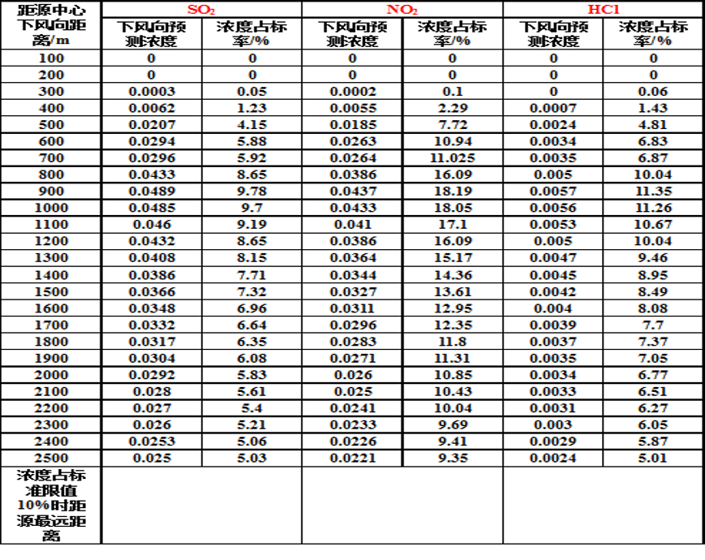
   - 环境空气敏感区的确定
   - 污染气象调查
      - 污染气象要素指与大气污染或大气净化有关的那部分气象要素
   - 监测因子的确定
      - 排放量大小、项目特征污染物、大气环境质量制约因子
   > 某丘陵地区拟建一条5000t/d水泥熟料生产线，该厂生产310d,24h,外排大气污染物SO2，NO2，PM10，排放量分别为124.67t/a，2411.3t/a和366.57t/a,常规大气监测大气空气质量良好，周围有三个企业，分别是A、B水泥厂，Z冶炼厂，周围敏感目标为村镇，主导风向为西北风。制定其现状监测计划。  
   > 分析：
   > - 第一步确定工作等级
   > - 第二步确定评价范围
   > - 第三步制定大气监测方案
- 大气环境质量现状评价
   > 先统计监测结果，然后从大气污染物监测的浓度均值范围、超标率、单因子指数等几个方面评价区域大气环境质量现状评价。
   - 监测结果统计方法
      - 主要：浓度范围、各取值时间的平均值、超标率、超标倍数等
   - 大气环境质量现状评价方法
      - 常使用：小时、日均、月均、年均浓度进行评价
      - 单项指数法
      - 综合指数法
         - 空气污染指数API（Air Pollution Index）
   - 现状评价结论
      - 污染物浓度时空分布特征
      - 与气象条件的关系
- 空气污染指数(API)
   - 污染参数的选取
   > 目前计入大气污染指数的污染物有SO2、NO2、PM10、CO和O3，其中SO2、NO2、PM10三项以日均值计，CO和O3两项以1小时均值计
   - 根据"空气污染指数分级浓度限值”进行计算

## 大气环境影响预测与评价
- 大气环境影响预测方法
   - 预测模式
      - 估算模式
      - 进一步预测模式
- 大气环境预测的步骤
   - ...看不懂

# 第七章 城市水环境与水污染控制
## 第一节  水体污染及其危害
- 概念
   - 水体：河流、湖泊、沼泽、水库、冰川和海洋等“贮水体”的总称
   - 水体污染：排入水体的污染物在数量上超过了该物质在水体中的本底含量和水体的环境容量，从而导致水体的物理、化学和生物特征发生不良变化，破坏了原有的生态系统及水体的功能 
- 水体中主要污染物及其危害
   - 无机无毒物
      - 颗粒状污染物
      - 酸、碱、无机盐类
      - 氮、磷等植物营养盐
   - 无机有毒物
      - 氰化物
      - 砷
      - 重金属毒性物质
   - 有机无毒物（耗氧物质）
   - 有机有毒物
   - 石油类污染物
   - 放射性污染物
- 主要的评价参数（评价因子）
   - 物理参数：温度、嗅、味、色度、浊度
   - 化学参数：有机指标（COD、BOD、DO、油类、酚）无机指标（含盐量、硬度、PH、酸碱度、重金属、铁、锰、氯离子、硫酸根、硫离子、氮、磷）
   - 生物参数：大肠杆菌数
- 水质评价指标及度量单位
   - 综合性的水质指标：如生化需氧量(BOD)、化学需氧量（COD）、总氮 (TN)、总磷(TP)、酸碱强度(pH)等
   - 对于以重量表示的污染物浓度，常以mg/L度量, 温度以度计，细菌浓度以个/L计，放射性污染浓度以Bq/L计等等
   - 溶解氧(DO)：指溶解在水中的分子氧O2， mg/L，可采用温克勒氏法、溶解氧电极法和溶氧仪测定
   - 生化需氧量(Biochemical Oxygen Demand ，简称 BOD)：水体中好氧微生物分解有机物过程中消耗的水中溶解氧量，单位mg/L
   - 化学需氧量（ Chemical Oxygen Demand, 简称COD）：用强氧化剂-重铬酸钾或高锰酸盐，在酸性条件下将单位体积水中有机物氧化成CO2和H2O的耗氧量，单位mg/L
   - 总需氧量（TOD）:有机物由C、H、N、S等元素组成，有机物完全被氧化（C、H、N、S分别被氧化成CO2、H2O、NO和SO2）的需氧量,单位mg/L
   - 总有机碳(TOC)：水体中有机污染物的总含碳量，单位mg/L
   - 悬浮物：用滤膜或滤纸过滤单位体积的水，所截留下的物质，单位mg/L
   - 有毒物质
   - 总氮(TN)：有机氮、氨氮、亚硝酸盐氮、 硝酸盐氮含氮量的总和，N mg/L 
   - 总磷(TP)：磷元素的总和，P mg/L
   - pH值
   - 大肠菌群数：单位体积水中大肠菌群的数目，单位个/升。表示水体受粪便污染的程度和作为饮用水的安全程度 
## 第二节  城市主要水污染源
- 工业污染源
- 生活污染源
## 第三节  水体的自净作用
- 水体自净
   - 概念：水体在环境容量范围内，经过自身的物理、化学、生物作用，使排入的污染物质的浓度和毒性随时间推移在向下游流动过程中自然降低
   - 水体自净的主要过程
      - 物理过程
      - 化学及物理化学过程
      - 生物化学过程
- 物理自净过程-水体的稀释
- 化学自净过程
- 生物自净过程（生物体是水体自净过程中最活跃、最积极的因素）
- 氧垂曲线
## 第四节  水污染综合防治
 > 水环境污染防治的途径主要有两种：一是减少污染物的排放，二是提高或充分利用水体的自净能力。
 - 减少污染物排放负荷
   - 清洁生产工艺
   - 浓度控制
   - 总量控制
   - 污水处理
- 提高或充分利用水体纳污容量
   - 人工复氧
   - 污水调节
   - 河流流量调控
- 污水处理概述
   - 物理法：重力分离、过滤、气浮、离心分离、反渗透法
   - 化学法
      - 化学沉淀法
      - 混凝法
      - 中和法
      - 氧化还原法
   - 物理化学法
      - 萃取（液—液）法
      - 吸附法
      - 离子交换法
      - 电渗析法
   - 生物法
      - 好氧生物处理法
         - 活性泥污法
         - 生物膜法
      - 厌氧生物处理法
- 污水处理流程
   - 按处理程度分为一级、二级和三级（深度）处理。
      - 一级处理主要是去除污水中呈悬浮状的固体污染物质，物理处理法中的大部分用作一级处理， BOD去除率只能达30%左右；
      - 二级处理用于大幅度地去除污水中呈胶体和溶解状态的有机性污染物质，常采用生物法，BOD去除率可达90%以上；
      - 三级（深度）处理以污水回收、再次复用为主，进一步去除废水中的悬浮物质、无机盐类及其他污染物质
   - 遵循先易后难，先简后繁的规律

# 第八章 城市地表水环境调查与评价
## 污染源评价
- 等标污染负荷
   - (排放浓度*排放量) / 标准浓度。得到标准浓度下的排放量称为等标排放量（等标污染负荷）
   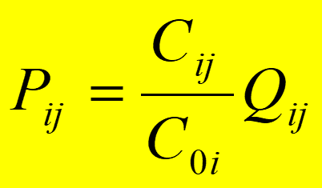
   > Qij 是第 j 个污染源的介质排放量，Cij是该污染源中第 i 种污染物的排放浓度，C0i为第 i 种污染物的排放标准。由于Cij与C0i 的比值是一个无因次量，等标污染负荷具有与排放量相同的因次  

   > 等标污染负荷的公式还可以表示成：某种污染物的绝对排放量与排放标准的比值。即Pi=Gi/Si
   > - Pi—某污染物i的等标污染负荷；
   > - Gi—某污染物i的排放量，**t/a**；
   > - Si—某污染物i的排放标准（对气mg/m3，对水mg/L）。
- 污染源的等标污染负荷
   - 一个污染源（序号为 j ） 的等标污染负荷，等于其所排各种污染物等标污染负荷之和。
   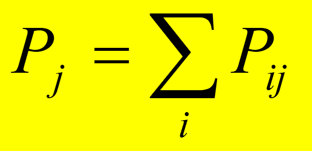
   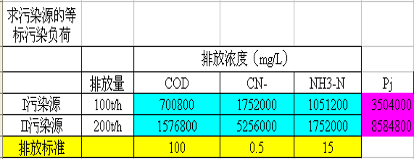
- 污染物的等标污染负荷
   - 整个评价范围内的多个污染源都含有第 i 种污染物，则该污染物在整个评价范围内的等标污染负荷等于其境内所有污染源对该污染物等标污染负荷之和
   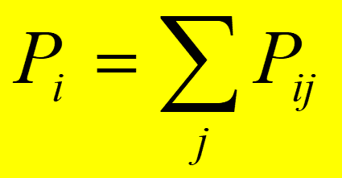
   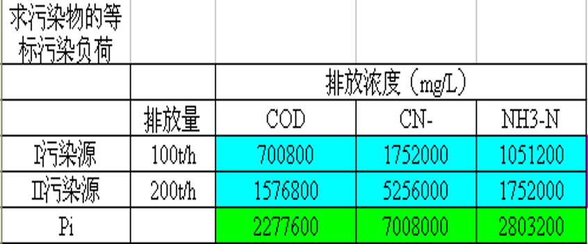
- 总污染负荷
   - 整个评价范围内的所有污染源的所有污染物的等标污染负荷之和，称为该评价范围内的总等标污染负荷
   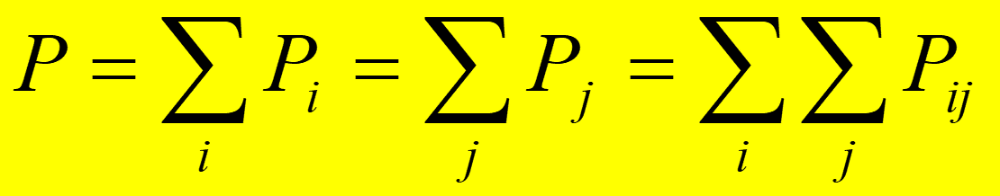
   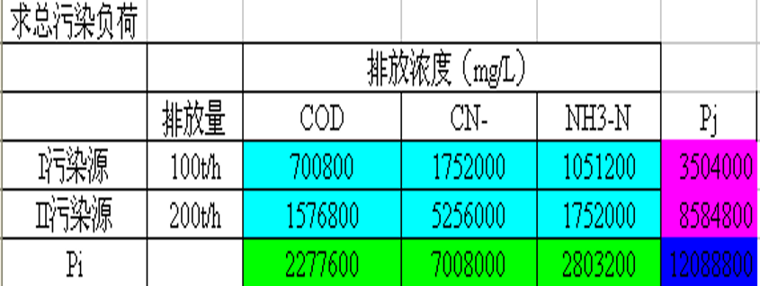
- 污染源的污染负荷比
   - 在整个评价范围内，一个污染源所排放所有污染物的等标污染负荷之和占该评价范围总等标污染负荷之百分比，称为该污染源对于这个评价范围的污染负荷比，记作Kj。
   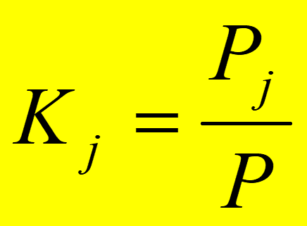
- 污染物的污染负荷比
   - 在整个评价范围内，所有污染源所排放的同一种污染物的等标污染负荷之和占该评价范围总等标污染负荷之百分比，称为该污染物对于这个评价范围的污染负荷比，记作Ki
   - 污染负荷比中的最大值对应于评价范围内最主要的污染物
   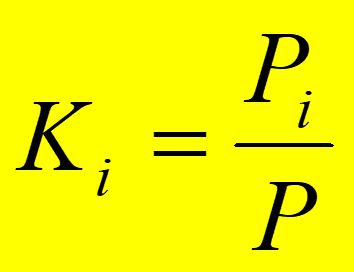
- 主要污染物和污染源的确定
   > 按等标污染负荷大小排列，计算累计百分比，将累计百分比大于80%的污染源（物）列为该区域的主要污染源（物）

## 第二节  地表水水质调查与评价
- 评价因子的取值
   - 内梅罗平均值 $\rho_i=
   (
      \frac
      {\rho^{2}_{imax}+\rho^{2}_{ik}}
      {2}
   )^{1/2}$
   - ρi—i参数的评价浓度值；
   - ρik—i参数监测数据(共k个)的平均值；
   - ρimax—i参数监测数据集中的最大值。
- 评价方法
   - 单项水质参数评价
      - 一般水质因子 
      - 特殊水质因子
   - 多项水质参数综合评价法
## 水质预测
- 水体自净
   > 水体在其环境容量范围内，经过自身的物理、化学和生物作用，使受纳的污染物浓度不断降低，逐渐恢复原有水质的过程
   - 污染物在水体中的迁移和转化
      - 推流迁移
      - 分散稀释
      - 转化和运移
## 河流水质预测模型
### 河流中污染物的混合和衰减模型
- 完全混合模型（零维）
   
   - C －废水与河水完全混合后污染物的浓度，mg/L
   - Qp  －排污口上游来水流量，m3/s
   - Cp －排污口上游河流中污染物浓度，mg/L
   - QE －排入河流的废水流量，m3/s
   - CE －废水中污染物浓度， mg/L
   - 模型的适用条件：a 河流充分混合段；b 持久性污染物；
   c河流为恒定流；d 废水连续稳定排放。
- 稳态条件下的一维混合衰减模型
   - 假设x=0时，$\rho$＝$\rho_0$=，即起点完全混合(使用零维完全混合模型)，则：
   
   - $E_x$ － 废水与河水的纵向混合系数，$m_2$/s
   - K －污染物的衰减系数，1/s
   忽略扩散作用时，模型的解为：
   
   - $\rho_0$- 起始断面水质浓度mg/L；
   - K-衰减系数1/**d**；（1/d单位是天，86400秒）
   - x－断面间河段长m; 
   - u－河段平均流速 m/s
   > [例1]一个改扩建工程拟向河流排放废水，废水量q＝0.15$m^3$／s，苯酚浓度为30μg／L，河流流量Q＝5.5$m^3$／s，流速u＝0.3m／s，苯酚背景浓度为 0.5 μg ／L，苯酚的降解（衰减）系数K＝0.2$d^{-1}$，纵向弥散系数Ex＝10$m^2$／s。求排放点下游10km处的苯酚浓度。
- BOD－DO耦合模型（S－P模型）
   - $\rho_{BOD_0}$（初始生物耗氧量）和$\rho_{D_0}$（初始氧亏量，根据$DO_s-DO_0$计算）的计算采用完全混合模型
   
   
   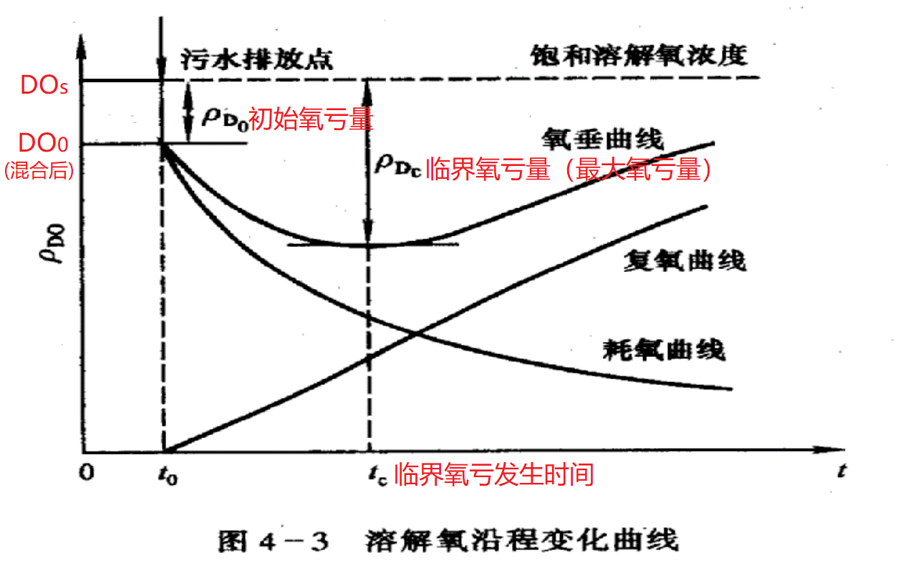
   t温度时的溶氧量：
   
   氧亏值=饱和溶解氧浓度-当前溶解氧浓度（即完全混合模型计算之后的溶解氧浓度）
   - K1- BOD衰减(耗氧)系数，1/d
   - K2- 河流复氧系数，1/d
   > 一拟建工厂，废水处理后排入附近河流。现状如下：河流流量14$m^3$/s，$BOD_5$为2.0mg/L，河水水温$20^oC$，溶解氧浓度8.0 mg/L；排入工业废水，$BOD_5$在处理前800mg/L，水温$20^oC$，流量3.5$m^3$/s，废水排放前经过处理溶解氧浓度4.0mg/L，若河水与废水迅速混合，混合后河道平均水深0.8m，河宽15m，k1（$20^oC$）=0.23$d^{-1}$、k2=3.0$d^{-1}$，若河流溶解氧标准为5.0mg/L，计算工厂削减多少$BOD_5$才能排放进入河流。 

- 托马斯(Thomas)模型
   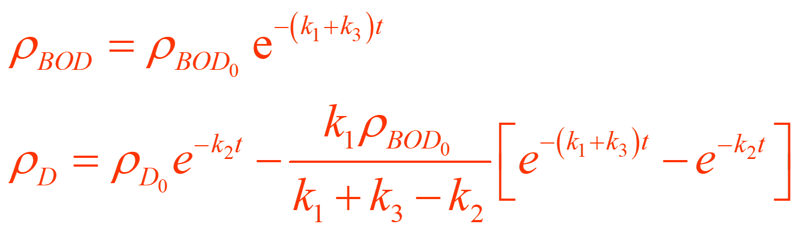
   > 河流Q=$216*10^4m^3/d$、流速u=46km/d，水温T=$13.6^oC$，k1=0.94$d^{-1}$,k2=1.82$d^{-1}$,k3=-0.17$d^{-1}$。河流始端排放废水Q1=$10*10^4$$m^3/d$，$BOD_5$为500mg/L，溶解氧为0；上游河水$BOD_5$为0，溶解氧为8.95mg/L；求河流排入口下游6km处河水的$BOD_5$和氧亏值？

## 开发行动对地表水影响的识别
- 工业建设项目
   - 石油炼制工业
   - 钢铁工业
   - 铝和有色金属生产
   - 化学工业
      - 无机化工产品制造业
      - 有机化工
   - 食品工业
   - 制浆和造纸业
- 水利工程
   - 开辟航道工程
   - 灌溉工程
   - 小型水库
   - 大型水库和水电工程建设
- 农业和畜牧业开发
- 矿业开发
- 城市污水处理厂和垃圾填埋场

# 第9章 城市噪声污染与控制
## 第一节  城市噪声污染及危害
- 噪声的来源和分类
   > 噪声是指人们不需要的频率在20—20000Hz的范围内的可听声。它包括杂乱不协调的声音，也包括影响人们工作、学习、思考、休息的音乐等声音。 
   - 产生噪声的声源称为噪声源，噪声源有以下几种分类方法：
      - （1）按噪声产生的机理，可以分为机械噪声、空气动力噪声和电磁噪声三大类。 
      - （2）按照噪声随时间的变化关系，可以分为稳态噪声和非稳态噪声两大类。 
      - （3）按照来源或者与人们日常活动的关系，可以分为工业生产噪声、建筑施工噪声、交通工具噪声、日常活动噪声、自然噪声等。
## 第二节  声音的物理特性和环境噪声评价量
- 声功率（W）
- 声强（I）
- 声压（p）
> 声压（p）的平方=声强（I）×介质密度（ρ）×声速（C）
- 分贝
- 声压和声压级
   > 声压是衡量声音大小的尺度，其单位为N/m2或Pa。人耳对1000Hz的听阈声压为2×10－5N/m2，痛阈声压为20 N/m2，其间相差100万倍。显然用声压的绝对值表示声音的大小是不方便的。为了方便应用，人们便根据人耳对声音强弱变化响应的特性，引出一个 对数 量来表示声音的大小，这就是声压级。所谓声压级就是声压的平方与一个基准的声压平方比值的对数值
   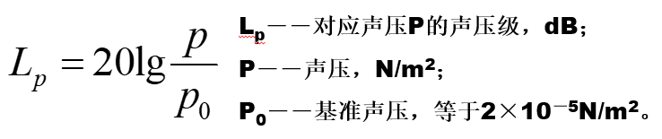
   - 噪声的叠加
   > 声功率、声强可直接叠加：
   I总=I1+I2，W总=W1+W2   
   声压相加：
   $P总^2$=$p1^2+p2^2$

   > 总声压级：
   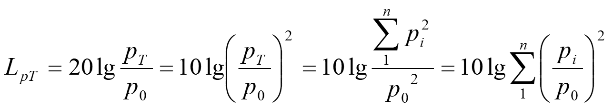
   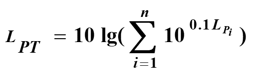

## 第三节  噪声的衰减和反射效应
- 点声源
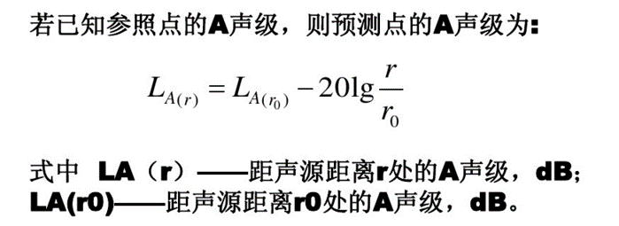
- 线声源
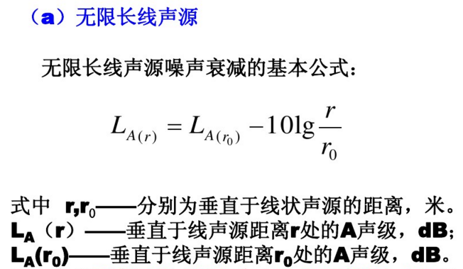
- 面声源
   - $<a/\pi$不衰减
   - $>a/\pi,<b/\pi$线衰减
   - $>b/\pi$点衰减
## 第四节  噪声环境影响预测
## 第五节  城市噪声污染防治
- 从声源上降低噪声
- 从噪声传播途径上降低噪声
- 从受声敏感目标自身降低噪声

# 第十章 城市固体废物污染与控制
## 第一节  固体废物污染
- 固体废物
   - 概念：人类在生产、加工、流通、消费以及生活等过程中，提取目的组分后所丢弃的固态或半固态的物质
   - 分类
      - 按化学性质：有机废物、无机废物
      - 按危害状况：危险废物、一般废物
      - 按来源：工业、矿业、城市、农业和放射性固体废物

## 第二节  固体废物的控制与处理
## 第三节  城市垃圾的处理

   
